# 📐 Class Diagram - Popcat Game

เอกสารนี้แสดง Class Diagram แบบครบถ้วนของระบบ Popcat Game

## 🎯 จำนวน Classes และ Interfaces

- **Backend Classes**: 11 classes
- **Frontend Classes**: 3 classes
- **Interfaces**: 3 interfaces
- **รวมทั้งหมด**: 17 components

---

## 📊 Full Class Diagram

```mermaid
classDiagram
    %% ===========================
    %% BACKEND - ENTITIES
    %% ===========================
    class BaseEntity {
        <<abstract>>
        #ObjectId _id
        #Date createdAt
        #Date updatedAt
        +constructor(id?)
        +get id() string
        #updateTimestamp() void
        +toJSON()* Record~string, any~
        +validate()* boolean
    }

    class Click {
        -number count
        -string sessionId
        +constructor(sessionId, count, id?)
        +get clickCount() number
        +get session() string
        +setCount(value) void
        +increment() void
        +toJSON() Record~string, any~
        +validate() boolean
    }

    class LeaderboardEntry {
        -string username
        -number totalClicks
        -number rank
        +constructor(username, totalClicks, rank, id?)
        +get playerName() string
        +get clicks() number
        +get position() number
        +setRank(rank) void
        +toJSON() Record~string, any~
        +validate() boolean
    }

    BaseEntity <|-- Click : extends
    BaseEntity <|-- LeaderboardEntry : extends

    %% ===========================
    %% BACKEND - REPOSITORIES
    %% ===========================
    class IRepository~T~ {
        <<interface>>
        +create(entity) Promise~T~
        +findById(id) Promise~T~
        +update(id, entity) Promise~T~
        +delete(id) Promise~boolean~
        +findAll() Promise~T[]~
    }

    class IClickRepository {
        <<interface>>
        +findBySessionId(sessionId) Promise~Click~
        +incrementClick(sessionId) Promise~Click~
        +getTotalClicks() Promise~number~
    }

    class ILeaderboardRepository {
        <<interface>>
        +findTopPlayers(limit) Promise~LeaderboardEntry[]~
        +updateRankings() Promise~void~
        +findByUsername(username) Promise~LeaderboardEntry~
    }

    class ClickRepository {
        -Collection collection
        -DatabaseConnection dbConnection
        +constructor(dbConnection)
        +create(entity) Promise~Click~
        +findById(id) Promise~Click~
        +findBySessionId(sessionId) Promise~Click~
        +incrementClick(sessionId) Promise~Click~
        +getTotalClicks() Promise~number~
    }

    class LeaderboardRepository {
        -Collection collection
        -DatabaseConnection dbConnection
        +constructor(dbConnection)
        +create(entity) Promise~LeaderboardEntry~
        +findById(id) Promise~LeaderboardEntry~
        +findTopPlayers(limit) Promise~LeaderboardEntry[]~
        +updateRankings() Promise~void~
        +findByUsername(username) Promise~LeaderboardEntry~
    }

    IRepository~T~ <|-- IClickRepository : extends
    IRepository~T~ <|-- ILeaderboardRepository : extends
    IClickRepository <|.. ClickRepository : implements
    ILeaderboardRepository <|.. LeaderboardRepository : implements

    %% ===========================
    %% BACKEND - SERVICES
    %% ===========================
    class BaseService~T~ {
        <<abstract>>
        +processData(data)* Promise~T~
        +validateInput(data)* boolean
        #log(message) void
    }

    class ClickService {
        -ClickRepository clickRepository
        +constructor(clickRepository)
        +handleClick(sessionId) Promise~Click~
        +getClicksBySession(sessionId) Promise~Click~
        +getTotalClicks() Promise~number~
        +processData(data) Promise~Click~
        +validateInput(data) boolean
    }

    class LeaderboardService {
        -LeaderboardRepository leaderboardRepository
        +constructor(leaderboardRepository)
        +getTopPlayers(limit) Promise~LeaderboardEntry[]~
        +updatePlayerScore(username, clicks) Promise~LeaderboardEntry~
        +refreshRankings() Promise~void~
        +processData(data) Promise~LeaderboardEntry~
        +validateInput(data) boolean
    }

    BaseService~T~ <|-- ClickService : extends
    BaseService~T~ <|-- LeaderboardService : extends
    ClickService *-- ClickRepository : has-a
    LeaderboardService *-- LeaderboardRepository : has-a

    %% ===========================
    %% BACKEND - INFRASTRUCTURE
    %% ===========================
    class DatabaseConnection {
        <<Singleton>>
        -DatabaseConnection instance$
        -MongoClient client
        -Db database
        -string uri
        -constructor(uri)
        +getInstance(uri)$ DatabaseConnection
        +connect() Promise~void~
        +disconnect() Promise~void~
        +getDatabase() Db
        +isConnected() boolean
    }

    class Config {
        <<Singleton>>
        -Config instance$
        -ProcessEnv env
        -constructor()
        +getInstance()$ Config
        +get mongoUri() string
        +get apiPort() number
        +get frontendPort() number
    }

    ClickRepository *-- DatabaseConnection : has-a
    LeaderboardRepository *-- DatabaseConnection : has-a

    %% ===========================
    %% BACKEND - APPLICATION
    %% ===========================
    class PopcatApplication {
        -Elysia app
        -Config config
        -DatabaseConnection dbConnection
        -ClickService clickService
        -LeaderboardService leaderboardService
        +constructor()
        -initializeServices() Promise~void~
        -setupRoutes() void
        -setupCORS() void
        +start() Promise~void~
    }

    PopcatApplication *-- Config : has-a
    PopcatApplication *-- DatabaseConnection : has-a
    PopcatApplication *-- ClickService : has-a
    PopcatApplication *-- LeaderboardService : has-a

    %% ===========================
    %% FRONTEND - API CLIENTS
    %% ===========================
    class BaseApiClient {
        <<abstract>>
        #string baseUrl
        +constructor(baseUrl)
        #fetch~T~(endpoint, options?) Promise~T~
        #handleResponse~T~(response)* Promise~T~
        #handleError(error)* void
        #get~T~(endpoint) Promise~T~
        #post~T~(endpoint, data?) Promise~T~
    }

    class PopcatApiClient {
        <<Singleton>>
        -PopcatApiClient instance$
        -constructor()
        +getInstance()$ PopcatApiClient
        +recordClick(sessionId) Promise~ApiResponse~
        +getClicksBySession(sessionId) Promise~ApiResponse~
        +getTotalClicks() Promise~ApiResponse~
        +getLeaderboard(limit?) Promise~ApiResponse~
        +updateLeaderboard(username, clicks) Promise~ApiResponse~
        #handleResponse~T~(response) Promise~T~
        #handleError(error) void
    }

    BaseApiClient <|-- PopcatApiClient : extends

    %% ===========================
    %% FRONTEND - STATE MANAGEMENT
    %% ===========================
    class BaseStateManager {
        <<abstract>>
        #any state
        #getInitialState()* any
        +getState()* any
        +setState(newState)* void
        #notifyListeners() void
    }

    class GameStateManager {
        <<Singleton>>
        -GameStateManager instance$
        -GameState state
        -Function[] listeners
        -constructor()
        +getInstance()$ GameStateManager
        #getInitialState() GameState
        +getState() GameState
        +setState(newState) void
        +incrementClick() void
        +setSessionId(sessionId) void
        +setUsername(username) void
        +subscribe(listener) Function
    }

    BaseStateManager <|-- GameStateManager : extends

    %% ===========================
    %% CROSS-LAYER RELATIONSHIPS
    %% ===========================
    PopcatApiClient ..> Click : uses
    PopcatApiClient ..> LeaderboardEntry : uses
    GameStateManager ..> PopcatApiClient : uses
```



---

## 📋 รายละเอียดแต่ละ Layer

### 1. **Entities Layer** (3 Classes)

| Class | Type | หน้าที่ |
|-------|------|---------|
| `BaseEntity` | Abstract | Base class สำหรับทุก Entity, จัดการ `_id`, timestamps |
| `Click` | Concrete | เก็บข้อมูลการคลิก, validation, business rules |
| `LeaderboardEntry` | Concrete | เก็บข้อมูลตารางคะแนน, ranking |

**OOP Principles**: Inheritance, Encapsulation, Abstraction

---

### 2. **Repositories Layer** (5 Interfaces/Classes)

| Component | Type | หน้าที่ |
|-----------|------|---------|
| `IRepository<T>` | Interface | Generic interface สำหรับ CRUD operations |
| `IClickRepository` | Interface | Interface เฉพาะสำหรับ Click operations |
| `ILeaderboardRepository` | Interface | Interface เฉพาะสำหรับ Leaderboard operations |
| `ClickRepository` | Class | Implementation สำหรับจัดการข้อมูล Click |
| `LeaderboardRepository` | Class | Implementation สำหรับจัดการข้อมูล Leaderboard |

**OOP Principles**: Polymorphism, Abstraction, Composition

**Design Pattern**: Repository Pattern

---

### 3. **Services Layer** (3 Classes)

| Class | Type | หน้าที่ |
|-------|------|---------|
| `BaseService<T>` | Abstract | Base class สำหรับทุก Service, logging |
| `ClickService` | Concrete | Business logic สำหรับการคลิก |
| `LeaderboardService` | Concrete | Business logic สำหรับตารางคะแนน |

**OOP Principles**: Inheritance, Composition, Abstraction

**Design Pattern**: Service Pattern

---

### 4. **Infrastructure Layer** (2 Classes)

| Class | Pattern | หน้าที่ |
|-------|---------|---------|
| `DatabaseConnection` | Singleton | จัดการการเชื่อมต่อ MongoDB, แชร์ connection |
| `Config` | Singleton | จัดการ environment variables, configuration |

**OOP Principles**: Encapsulation, Singleton Pattern

---

### 5. **Application Layer** (1 Class)

| Class | หน้าที่ |
|-------|---------|
| `PopcatApplication` | รวม components ทั้งหมด, setup routes, initialize services |

**OOP Principles**: Composition

**Design Pattern**: Facade Pattern, Dependency Injection

---

### 6. **Frontend - API Clients** (2 Classes)

| Class | Type | หน้าที่ |
|-------|------|---------|
| `BaseApiClient` | Abstract | Base class สำหรับ HTTP communication |
| `PopcatApiClient` | Singleton | จัดการ API calls ไปยัง backend |

**OOP Principles**: Inheritance, Encapsulation

---

### 7. **Frontend - State Management** (2 Classes)

| Class | Type | หน้าที่ |
|-------|------|---------|
| `BaseStateManager` | Abstract | Base class สำหรับ state management |
| `GameStateManager` | Singleton | จัดการ game state, observers |

**OOP Principles**: Inheritance, Encapsulation

**Design Pattern**: Singleton, Observer Pattern

---

## 🔗 Relationships Summary

### Inheritance (IS-A)
```
BaseEntity
├── Click
└── LeaderboardEntry

BaseService<T>
├── ClickService
└── LeaderboardService

BaseApiClient
└── PopcatApiClient

BaseStateManager
└── GameStateManager
```

### Implementation (IMPLEMENTS)
```
IRepository<T>
├── IClickRepository → ClickRepository
└── ILeaderboardRepository → LeaderboardRepository
```

### Composition (HAS-A)
```
PopcatApplication
├── Config
├── DatabaseConnection
├── ClickService
│   └── ClickRepository
│       └── DatabaseConnection
└── LeaderboardService
    └── LeaderboardRepository
        └── DatabaseConnection
```

---

## 🎯 OOP Principles ที่ใช้

| Principle | Examples |
|-----------|----------|
| **Constructor** | ทุก Class มี constructor สำหรับ initialization |
| **Encapsulation** | Private fields + getter/setter, validation |
| **Inheritance** | Base classes → Child classes |
| **Abstraction** | Abstract classes และ interfaces |
| **Polymorphism** | IRepository interface, method overriding |
| **Composition** | Services contain repositories, Application contains services |

---

## 🛠️ Design Patterns ที่ใช้

| Pattern | Classes |
|---------|---------|
| **Singleton** | DatabaseConnection, Config, PopcatApiClient, GameStateManager |
| **Repository** | ClickRepository, LeaderboardRepository |
| **Service** | ClickService, LeaderboardService |
| **Observer** | GameStateManager (subscribers) |
| **Factory** | Entity creation in repositories |
| **Facade** | PopcatApplication |

---

## 📖 วิธีดู Diagram

### 1. **GitHub**
- เปิดไฟล์นี้บน GitHub จะเห็น diagram render อัตโนมัติ

### 2. **VS Code**
- ติดตั้ง extension: "Markdown Preview Mermaid Support"
- กด `Ctrl+Shift+V` (Windows) หรือ `Cmd+Shift+V` (Mac)

### 3. **Online Viewer**
- เข้า [Mermaid Live Editor](https://mermaid.live/)
- Copy code ใน block mermaid ไปวาง

### 4. **PlantUML**
- ใช้ไฟล์ `docs/class-diagram.puml`
- เปิดด้วย [PlantUML Online](http://www.plantuml.com/plantuml/uml/)
- หรือติดตั้ง PlantUML extension ใน VS Code

---

## 📚 อ่านเพิ่มเติม

- [OOP_EXAMPLES.md](../OOP_EXAMPLES.md) - ตัวอย่างโค้ด OOP ทั้ง 6 หลักการ
- [README.md](../README.md) - โครงสร้างโปรเจคและการใช้งาน
- [QUICK_START.md](../QUICK_START.md) - เริ่มต้นใช้งานอย่างรวดเร็ว

---

**สร้างด้วย ❤️ และหลักการ OOP ที่ดี**
